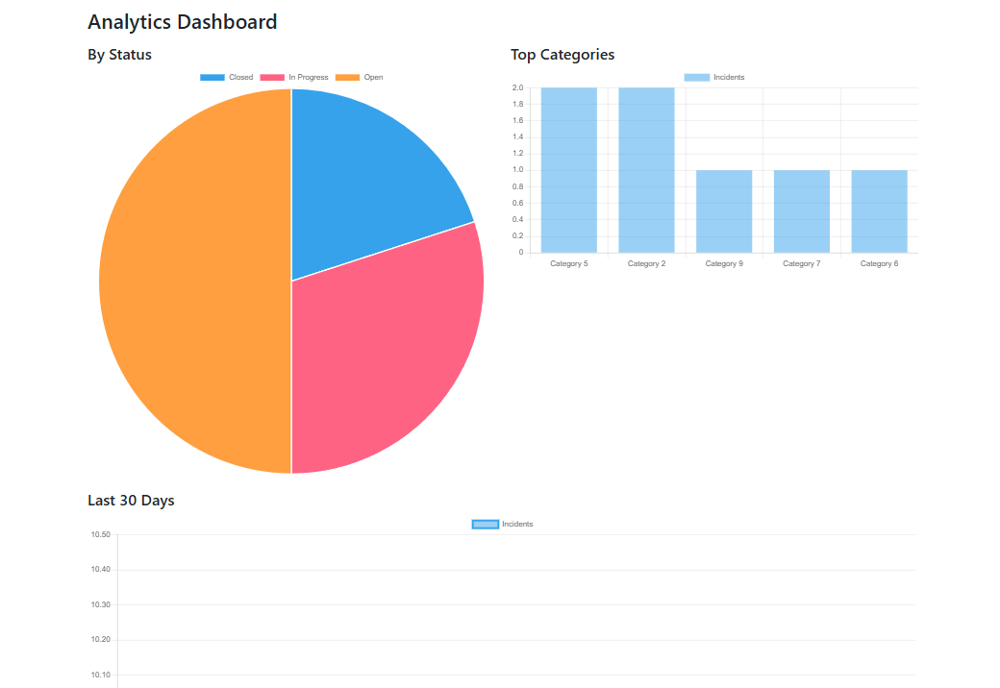
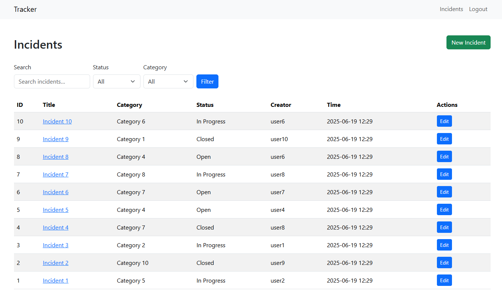
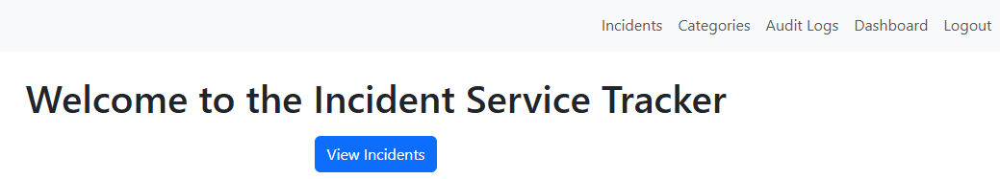
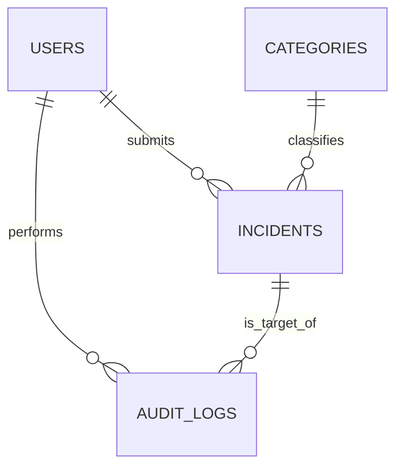

# Incident Tracker

[](https://www.python.org/)  
[](https://flask.palletsprojects.com/)  
[](LICENSE)

---

## Table of Contents

- [Project Overview](#project-overview)
- [Screenshots](#-screenshots)
- [Features](#features)
- [Security Features](#-security-features)
- [Architecture & Design](#architecture--design)
- [Getting Started](#getting-started)
  - [Prerequisites](#prerequisites)
  - [Installation](#installation)
  - [Configuration](#configuration)
  - [Database Setup](#database-setup)
  - [Running the App](#running-the-app)
- [Testing & CI](#testing--ci)
- [Performance Considerations](#-performance-considerations)
- [Deployment](#deployment-production)
- [Troubleshooting](#-troubleshooting)
- [Contributing](#contributing)
- [Roadmap](#roadmap)
- [License](#license)
- [Acknowledgements](#acknowledgements)

## Project Overview

**Incident Tracker** is a lightweight, Flask-based web application designed to streamline incident reporting and resolution workflows. By centralizing incident data—titles, descriptions, categories, statuses, and user assignments—the app eliminates reliance on fragmented spreadsheets or email chains, ensuring accountability and traceability across teams.

Users register, log in, and submit new incidents, while administrators manage user accounts, categories, and all incident records. Transactional emails confirm registration and notifications. Secure cookie flags and role-based access control mitigate risks of session hijacking and unauthorized data access.

## 🖼️ Screenshots

| Dashboard | Incident Form | Admin Panel |
|-----------|---------------|-------------|
|  |  |  |

## Features

- **User Roles & Authentication**: Registration, login, logout, and role-based access (regular vs. admin)
- **Incident Management**: CRUD operations for incidents with category assignments and status tracking
- **Category Administration**: Admin-only interface to create, edit, and delete incident categories
- **Email Notifications**: Welcome emails on registration via Flask-Mail and SMTP
- **Secure Sessions**: Flask-Login integration with HttpOnly, Secure, and SameSite cookie flags
- **Form Validation**: Robust input validation using WTForms for all user inputs
- **Database Migrations**: Schema version control via Flask-Migrate (Alembic)
- **Automated Testing & CI**: Linting, typing, and unit tests triggered on every pull request via GitHub Actions

## 🔒 Security Features

- **Account Lockout** - Automatic lockout after failed login attempts
- **Secure Sessions** - HttpOnly, Secure, and SameSite cookie flags
- **Input Validation** - Comprehensive form validation with WTForms
- **SQL Injection Protection** - SQLAlchemy ORM with parameterized queries
- **CSRF Protection** - Built-in Flask-WTF CSRF tokens
- **Password Hashing** - Werkzeug secure password hashing
- **Audit Logging** - Complete action history tracking

> 🛡️ **Security Disclosure**: Found a security issue? Please email alecashmore50@gmail.com

## Architecture & Design

The application follows the **Flask application factory pattern**:

```
app/                  # Main application package
├── auth/             # Authentication blueprint (routes, forms, models)
├── categories/       # Category management blueprint
├── incidents/        # Incident management blueprint
├── main/             # Public-facing pages and home route
├── templates/        # Jinja2 templates for UI
├── static/           # Static assets (CSS, JS)
├── extensions.py     # Initialization for SQLAlchemy, Migrate, Mail, LoginManager
└── config.py         # Environment-specific configuration
```

## 📊 Database Schema

### Data Models

- **User**  
  - `id` - Primary key
  - `username` - Unique username
  - `email` - User email address
  - `password_hash` - Hashed password
  - `role` - User role (admin/regular)
  - `failed_logins` - Failed login attempt counter
  - `lock_until` - Account lockout timestamp
  - `two_factor_secret` - 2FA secret key

- **Category**  
  - `id` - Primary key
  - `name` - Category name
  - `description` - Category description

- **Incident**  
  - `id` - Primary key
  - `title` - Incident title
  - `description` - Detailed description
  - `status` - Current status
  - `timestamp` - Creation timestamp
  - `updated_at` - Last update timestamp
  - `closed_at` - Resolution timestamp
  - `user_id` - Foreign key to User
  - `category_id` - Foreign key to Category

- **AuditLog**  
  - `id` - Primary key
  - `user_id` - Foreign key to User
  - `action` - Action performed
  - `target_type` - Type of target entity
  - `target_id` - ID of target entity
  - `timestamp` - Action timestamp

### Key Relationships & Indexes

- **Relationships:**
  - One User can have many Incidents
  - One Category can classify many Incidents  
  - All actions are logged in AuditLog for accountability

- **Database Indexes:**
  - `incidents.user_id` - Fast user incident lookups
  - `incidents.status` - Efficient status filtering
  - `incidents.created_at` - Timeline queries

### ERD



## Getting Started

### Prerequisites

- **Python 3.13+**  
- **Git**  
- **(Optional) SQLite CLI** - if you want to inspect the DB directly.  
- **SMTP credentials** for email (e.g. Gmail App Password, Mailtrap).
- **Third Party Authenticator** for 2FA (e.g. Google Authenticator)

---

### Installation

1. **Clone the repo**  
   ```bash
   git clone 'https://github.com/AlecAshmore01/incident_tracker.git'
   cd incident_tracker
   ```

2. **Create & activate a virtual environment**
   ```bash
   python -m venv venv
   source venv/bin/activate      # macOS/Linux
   venv\Scripts\Activate.ps1     # Windows PowerShell
   ```

3. **Install dependencies**
   ```bash
   pip install -r requirements.txt
   ```

### Configuration

1. **Create a file called `.env`** in the project root with:
   ```ini
   # .env
   FLASK_ENV=development
   SECRET_KEY=your-secret-key (Whatever you want this to be)
   DATABASE_URL=sqlite:///app.db
   MAIL_SERVER=smtp.gmail.com
   MAIL_PORT=587
   MAIL_USE_TLS=True
   MAIL_USERNAME=youremail@example.com
   MAIL_PASSWORD=your-app-password (Google Account -> Search 'App password' -> Create a new one)
   MAIL_DEFAULT_SENDER="Incident Tracker <youremail@example.com>"
   ```

2. **Then load it into your shell:**

   **macOS/Linux**
   ```bash
   export $(grep -v '^#' .env | xargs)
   ```

   **Windows PowerShell**
   ```powershell
   Get-Content .env | Foreach-Object {
     $pair = $_.Split('=',2)
     [Environment]::SetEnvironmentVariable($pair[0], $pair[1], 'Process')
   }
   ```

   > **Tip:** You can also install `python-dotenv` and let Flask auto-load your `.env`.

### Database Setup

1. **Run migrations**
   ```bash
   flask db upgrade
   ```

2. **(Optional) Create a default admin**
   
   If you haven't got a seed script, you can make one admin manually:
   ```bash
   flask shell
   ```
   ```python
   from app.extensions import db
   from app.models.user import User
   u = User(username='admin', email='admin@example.com', role='admin')
   u.set_password('Password123!')
   db.session.add(u)
   db.session.commit()
   exit()
   ```

3. **(Optional) Seed sample data**
   
   If you have a `seed.py`, run:
   ```bash
   python seed.py
   ```

### Running the App

```bash
python run.py
```

Then open your browser at `http://localhost:5000` or `http://127.0.0.1:5000`.

1. Register a new account (or log in with your seeded admin).
2. If you need admin rights, either promote yourself in the DB or use the steps above.

## Testing & CI

- **Unit & integration tests**
  ```bash
  pytest --cov=app
  ```

- **Type-checking**
  ```bash
  mypy app
  ```

- **Linting**
  ```bash
  flake8
  ```

These will be run automatically on every pull-request via GitHub Actions - Work in progress (see `.github/workflows/ci.yml`).

## ⚡ Performance Considerations

- **SQLite Limitations**: Suitable for development and small teams (<100 concurrent users)
- **Production Database**: Switch to PostgreSQL for better concurrent performance
- **Static Files**: Consider CDN for static assets in production
- **Caching**: Redis integration planned for session storage and caching

## Deployment (Production)

1. Set `FLASK_ENV=production` and a strong `SECRET_KEY`.
2. Use a real database (Postgres/MySQL) by updating `DATABASE_URL`.
3. Serve with Gunicorn (behind Nginx):
   ```bash
   pip install gunicorn
   gunicorn -w 4 "app:create_app()"
   ```
4. (Optional) Dockerize with your `Dockerfile` + `docker-compose.yml`.
   This feature is a work in progress.

## 🔧 Troubleshooting

### Common Issues

**Flask app won't start**
```bash
# Check if port 5000 is in use
lsof -i :5000
# Kill the process if needed
kill -9 <PID>
```

**Database migration fails**
```bash
# Reset migrations (⚠️ DESTROYS DATA)
rm -rf migrations/
flask db init
flask db migrate -m "Initial migration"
flask db upgrade
```

**Email not sending**
- Verify SMTP credentials in `.env`
- Check if Gmail requires App Password (not regular password)
- Test with a service like Mailtrap for development
- Ensure you're not connected to a VPN

### Getting Help
- 📖 Check our [Wiki](https://github.com/username/incident-tracker/wiki) for detailed guides - Currently under maintenance
- 💬 Join our [Discord](https://discord.gg) for community support
- 🐛 Report bugs via [GitHub Issues](https://github.com/username/incident-tracker/issues)

## Contributing

1. Fork the repository
2. Create a feature branch (`git checkout -b feature/AwesomeFeature`)
3. Commit your changes (`git commit -m 'Add awesome feature'`)
4. Push to the branch (`git push origin feature/AwesomeFeature`)
5. Open a pull request

Please adhere to the existing code style and include tests for new functionality.

## Roadmap

### 🚀 Planned Features
- [ ] **Bulk Operations** - Mass edit/delete incidents
- [ ] **API Endpoints** - RESTful API for integrations
- [ ] **Mobile App** - React Native companion app
- [ ] **Slack Integration** - Automated notifications
- [ ] **Advanced Reporting** - PDF exports and custom reports

### 🔄 In Progress
- [ ] Containerize the project for easy deployment
- [ ] Move to a hosted service using Postgres

### ✅ Completed
- [x] Basic incident CRUD operations
- [x] Email notifications
- [x] Role-based access control
- [x] Audit logging system
- [x] Account lockout protection
- [x] Advanced search and filtering
- [x] Two-Factor Authentication (2FA)
- [x] Dashboard analytics with charts and metrics for incident trends

## License

This project is licensed under the **MIT License**. See `LICENSE` for details.

## Acknowledgements

- Built with [Flask](https://flask.palletsprojects.com/)
- Inspired by modern incident management workflows
- Thanks to the open-source community for extensions and tools

---

*Crafted as a README to guide users, contributors, and maintainers through every aspect of the Incident Tracker project.  
**Lead Dev** - Alec Ashmore*