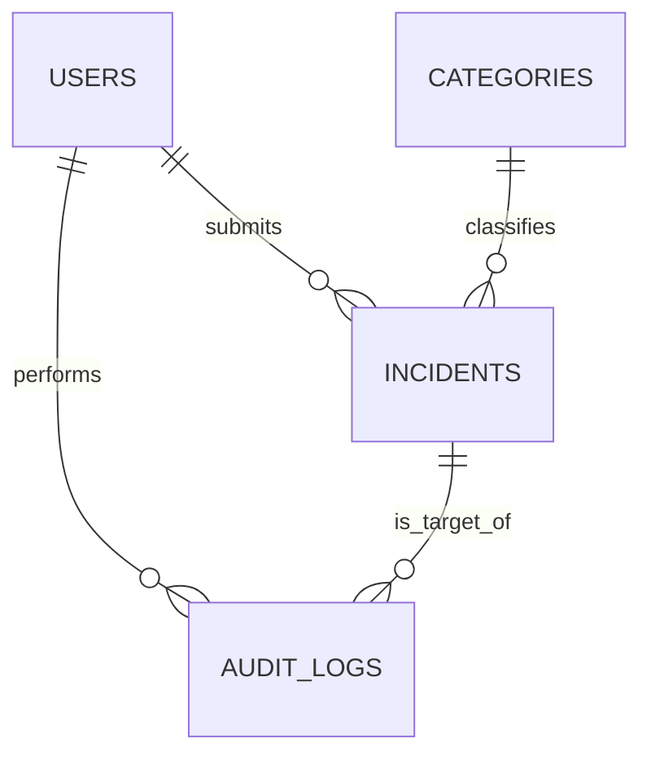

# Incident Tracker

[](https://www.python.org/)  
[](https://flask.palletsprojects.com/)  
[](LICENSE)

---

## Table of Contents

- [Project Overview](#project-overview)
- [Features](#features)
- [Architecture & Design](#architecture--design)
- [Getting Started](#getting-started)
  - [Prerequisites](#prerequisites)
  - [Installation](#installation)
  - [Configuration](#configuration)
- [Usage](#usage)
- [Testing & CI](#testing--ci)
- [Deployment](#deployment)
- [Contributing](#contributing)
- [Roadmap](#roadmap)
- [License](#license)
- [Acknowledgements](#acknowledgements)

## Project Overview

**Incident Tracker** is a lightweight, Flask-based web application designed to streamline incident reporting and resolution workflows. By centralizing incident data ; titles, descriptions, categories, statuses, and user assignments, the app eliminates reliance on fragmented spreadsheets or email chains, ensuring accountability and traceability across teams.

Users register, log in, and submit new incidents, while administrators manage user accounts, categories, and all incident records. Transactional emails confirm registration and notifications. Secure cookie flags and role-based access control mitigate risks of session hijacking and unauthorized data access.

## Features

- **User Roles & Authentication**: Registration, login, logout, and role-based access (regular vs. admin)
- **Incident Management**: CRUD operations for incidents with category assignments and status tracking
- **Category Administration**: Admin-only interface to create, edit, and delete incident categories
- **Email Notifications**: Welcome emails on registration via Flask-Mail and SMTP
- **Secure Sessions**: Flask-Login integration with HttpOnly, Secure, and SameSite cookie flags
- **Form Validation**: Robust input validation using WTForms for all user inputs
- **Database Migrations**: Schema version control via Flask-Migrate (Alembic)
- **Automated Testing & CI**: Linting, typing, and unit tests triggered on every pull request via GitHub Actions

## Architecture & Design

The application follows the **Flask application factory pattern**:

```
app/                  # Main application package
├── auth/             # Authentication blueprint (routes, forms, models)
├── categories/       # Category management blueprint
├── incidents/        # Incident management blueprint
├── main/             # Public-facing pages and home route
├── templates/        # Jinja2 templates for UI
├── static/           # Static assets (CSS, JS)
├── extensions.py     # Initialization for SQLAlchemy, Migrate, Mail, LoginManager
└── config.py         # Environment-specific configuration
```

### Data Models

- **User**  
  - `id`  
  - `username`  
  - `email`  
  - `password_hash`  
  - `role` (admin / regular)  
  - `failed_logins`  
  - `lock_until`  
  - `two_factor_secret`

- **Category**  
  - `id`  
  - `name`  
  - `description`

- **Incident**  
  - `id`  
  - `title`  
  - `description`  
  - `status`  
  - `timestamp`  
  - `updated_at`  
  - `closed_at`  
  - `user_id` (FK → User)  
  - `category_id` (FK → Category)

- **AuditLog**  
  - `id`  
  - `user_id` (FK → User)  
  - `action`  
  - `target_type`  
  - `target_id`  
  - `timestamp`

### ERD



## Getting Started

### Prerequisites

- Python 3.13
- Git
- SMTP credentials for email (e.g., Gmail, SendGrid)

### Installation

1. **Clone the repository**
   ```bash
   git clone <repository-url>
   cd incident_tracker
   ```

2. **Create and activate a virtual environment**
   ```bash
   python3 -m venv venv
   source venv/bin/activate
   ```

3. **Install dependencies**
   ```bash
   pip install -r requirements.txt
   ```

### Configuration

1. **Create a `.env` file** in the project root with the following variables:
   ```env
   FLASK_ENV=development
   SECRET_KEY=<your-secret-key>
   DATABASE_URL=sqlite:///instance/app.db
   MAIL_SERVER=smtp.example.com
   MAIL_PORT=587
   MAIL_USE_TLS=True
   MAIL_USERNAME=your-email@example.com
   MAIL_PASSWORD=your-email-password
   MAIL_DEFAULT_SENDER=Incident Tracker <your-email@example.com>
   ```

2. **Load environment variables** via:
   ```bash
   export $(cat .env | xargs)
   ```

## Usage

1. **Initialize database & seed data**
   ```bash
   flask db upgrade
   python seed.py
   ```

2. **Run the development server**
   ```bash
   flask run
   ```

3. **Access the app**
   
   Navigate to `http://localhost:5000`, register a new account or log in with the seeded admin (`admin@example.com` / `password`).

## Testing & CI

- **Unit Tests**: Run with PyTest:
  ```bash
  pytest --cov=app
  ```

- **Type Checking**: Ensure no type errors:
  ```bash
  mypy app
  ```

- **Linting**: Validate code style:
  ```bash
  flake8
  ```

These checks are automated via GitHub Actions defined in `.github/workflows/ci.yml`.

## Deployment

- **Production Config**: Set `FLASK_ENV=production` and secure `SECRET_KEY`
- **Database**: Use PostgreSQL or MySQL by updating `DATABASE_URL`
- **Web Server**: Deploy behind Gunicorn and Nginx:
  ```bash
  pip install gunicorn
  gunicorn -w 4 "app:create_app()"
  ```
- **Optional**: Containerize with Docker; see `Dockerfile` (Being Developed)

## Contributing

1. Fork the repository
2. Create a feature branch (`git checkout -b feature/AwesomeFeature`)
3. Commit your changes (`git commit -m 'Add awesome feature'`)
4. Push to the branch (`git push origin feature/AwesomeFeature`)
5. Open a pull request

Please adhere to the existing code style and include tests for new functionality.

## Roadmap

🚧 *Coming Soon* 🚧

## License

This project is licensed under the **MIT License**. See `LICENSE` for details.

## Acknowledgements

- Built with [Flask](https://flask.palletsprojects.com/)
- Inspired by modern incident management workflows
- Thanks to the open-source community for extensions and tools

---

*Crafted as a README to guide users, contributors, and maintainers through every aspect of the Incident Tracker project.
Lead Dev - Alec Ashmore*